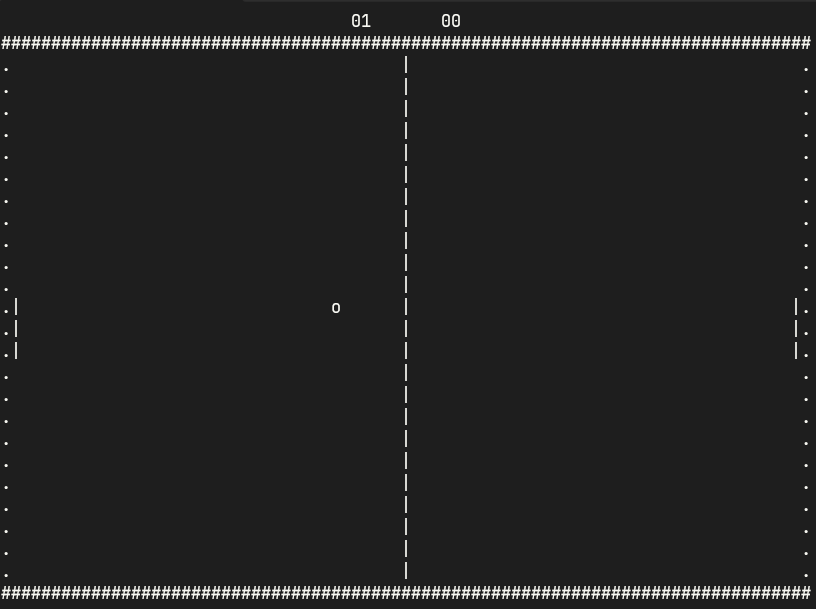

# Pong-on-C

Terminal game on C. Doesn't work on Windows unless you use WSL.
To run it you need to compile it with "-lncurses" flag.
For controls: A, Z for up and down for first player; K, M for up and down for second; Q to quit.
